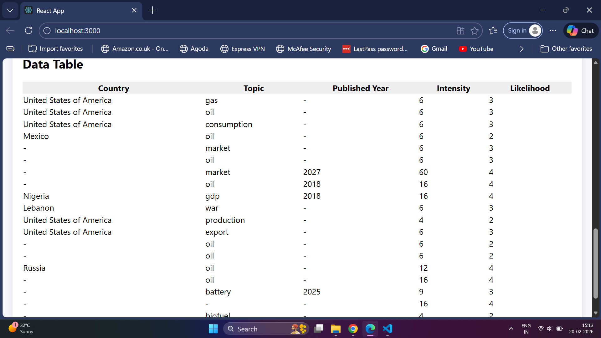
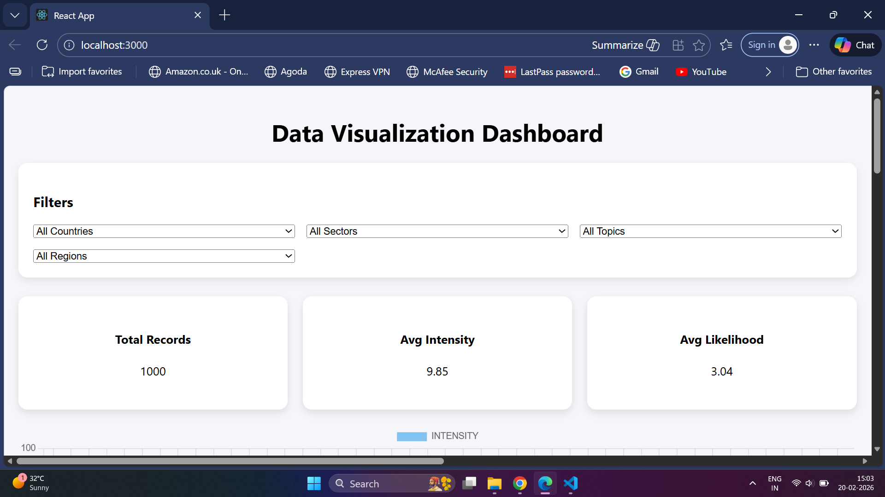

# 📊 Data Visualization Dashboard (MERN Stack)

A full-stack data visualization dashboard built using the MERN stack that allows users to explore, filter, and analyze large datasets through interactive charts and tables.

This project demonstrates real-world full-stack skills including API design, MongoDB querying, React hooks, and data visualization.

# 🚀 Features

1. 📈 Interactive charts (Intensity, Likelihood, Relevance, Region)

2. 🔍 Dynamic filtering by country, sector, topic, and region

3. 📋 Tabular data view with pagination-ready structure

4. ⚡ Efficient backend filtering using MongoDB queries

5. 🛡 Safe React state handling (no crashes on empty data)

6. 🌐 Environment-based API configuration

# 🛠 Tech Stack
## Frontend

React.js

Axios

Chart.js

React Hooks (useState, useEffect, useCallback)

CSS (custom styling)

## Backend

Node.js

Express.js

MongoDB

Mongoose

CORS

dotenv

# 📁 Project Structure
```
├── backend
│   ├── model.js
│   ├── routes.js
│   ├── server.js
│   ├── jsondata.json
│   └── .env
│
├── frontend
│   ├── src
│   │   ├── Dashboard.js
│   │   ├── Charts.js
│   │   ├── DataTable.js
│   │   ├── Filters.js
│   │   └── App.js
│   └── .env
│
└── README.md
```

# ⚙️ Setup Instructions
## 1️⃣ Clone the Repository
```
git clone https://github.com/your-username/data-visualization-dashboard.git
cd data-visualization-dashboard
```
## 2️⃣ Backend Setup
```
cd backend
npm install
```
### Create a .env file in backend/:
```
MONGO_URI=your_mongodb_connection_string
PORT=5000
```
### Start backend server:
```
node server.js
```
## 3️⃣ Insert Data into MongoDB (Required)

### Open browser and visit:
```
http://localhost:5000/api/insert-data
```
### You should see:
Data inserted successfully!

## 4️⃣ Frontend Setup
```
cd frontend
npm install
npm start
```
### Create a .env file in frontend/:

```
REACT_APP_API_URL=http://localhost:5000
```
## 🧪 API Endpoints
### Method	Endpoint	Description
- GET	/api/insert-data	Insert JSON data into MongoDB
- GET	/api/data	Fetch filtered dashboard data
- GET	/api/filters	Get filter dropdown values

## 📸 Screenshots

### Dashboard Overview


### Filters & KPIs


### Charts Visualization
.png)

.png)


## 🧠 Key Learnings

- Handling API response mismatches between frontend and backend

- Optimizing React hooks dependency management

- Designing clean REST APIs with Express and MongoDB

- Debugging real-world full-stack data flow issues

## 🚀 Future Improvements

- Pagination & infinite scrolling

- Dynamic filters from backend

- Caching and debounced API calls

- Authentication & role-based access

- Deployment with Docker

## 👩‍💻 Author

Poojitha Velamala
Aspiring Software Engineer | MERN Stack Developer

📌 Focused on building scalable, real-world web applications
